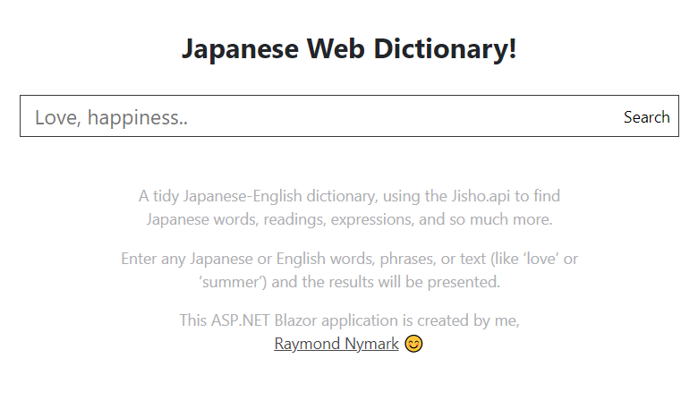
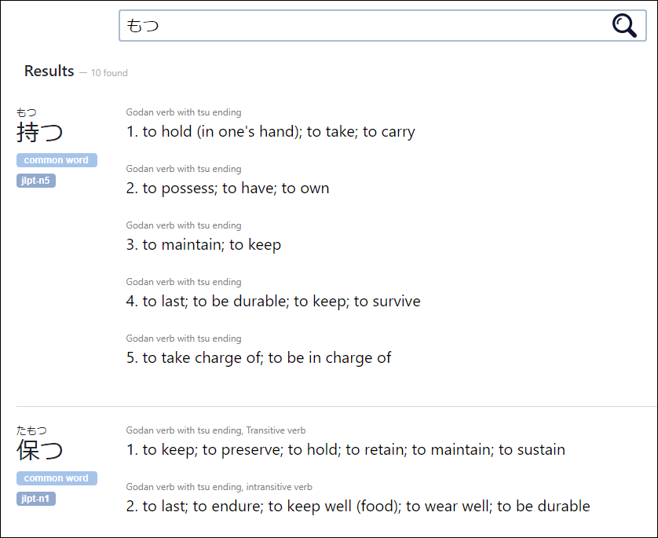
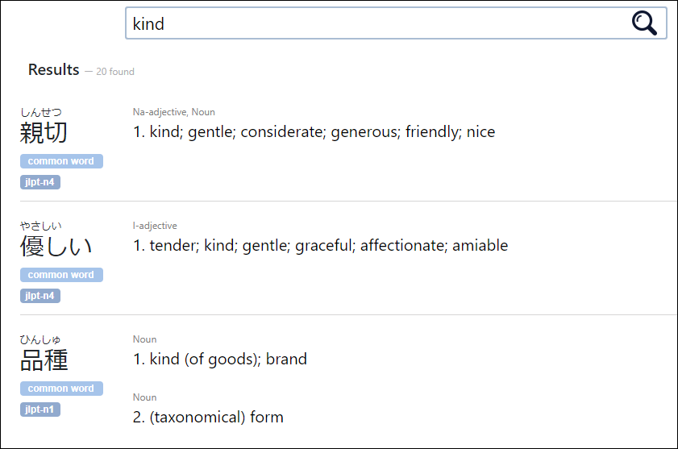

# Japanese Web Dictionary! ✏️️
An online dictionary for English-Japanese, using the the public jisho API for the dictionary data.  This web-application is created using **ASP.NET Core Blazor** and **.NET Core** for the back-end!

## What does it do?
- **You're able to...** 
	- Look up any English words or phrases and get the Japanese results for it
	- Look up any Japanese word or phrase and get the English results for it
	- Search for just parts of a word and get results that **just** contain the parts
	- See if a word is commonly used, if the common tag is appended
	- And figure out which JLPT-level a word belongs to!

Also does minor things like saving the search query as a URL so you can save links to specific results. 😊

&nbsp;

## The dictionary in action!**
**Gif to show what it's like to actually use the dictionary**

&nbsp;

## Handful of screenshots:

**The main landing page:**

&nbsp;

**Support for both Japanese and English search queries**

&nbsp;

Thank you for checking this out! 🙂