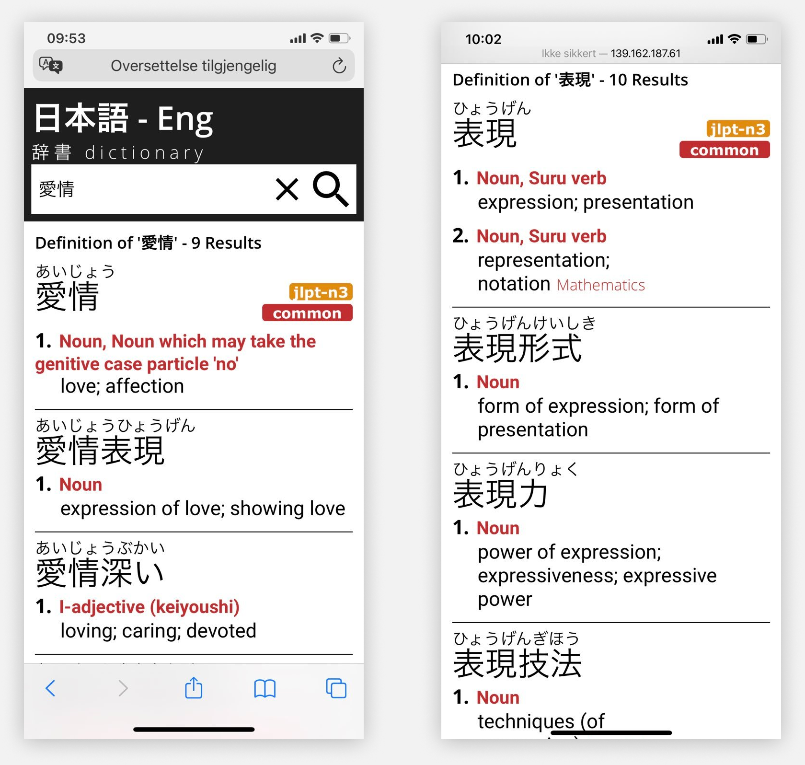
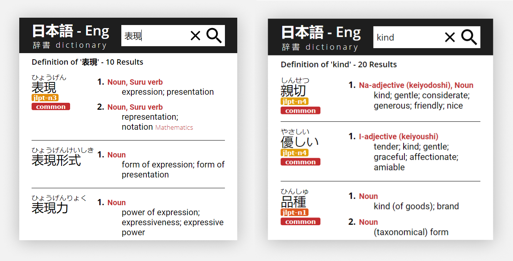

# Japanese Web Dictionary! ✏️️
An online dictionary for English-Japanese, using the the public jisho API for the dictionary data.  This web-application is created using **ASP.NET Core Blazor** and **.NET Core** for the back-end!

## What does it do?
- **You're able to...** 
	- Look up any English words or phrases and get the Japanese results for it
	- Look up any Japanese word or phrase and get the English results for it
	- Search for just parts of a word and get results that **just** contain the parts
	- See if a word is commonly used, if the common tag is appended
	- And figure out which JLPT-level a word belongs to!

Also does minor things like saving the search query as a URL so you can save links to specific results. 😊

## Want to check it out?
The app is usable here: **https://www.kisekinihongo.net/Search**

I've deployed the web-app on a Linux server, and the website will reflect the most recent version of the dictionary! 🌐 It should work on every modern web-browser, and even on phones.  Feel free to check it out :)

&nbsp;

## The dictionary in action!
&nbsp;

**Mobile friendly!**

&nbsp;
---

**Support for both Japanese and English search queries!**

&nbsp;
---

&nbsp;

Thank you for checking this out! I'm an avid fan of Japanese. Have a nice day 😊👍
